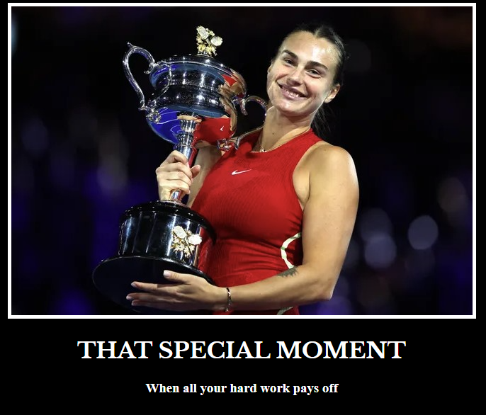

# 100 Days of Code: Day 44 - Intermediate CSS

## Project Overview
**Date:** 8/26/2024

**Goal:**  
Today's focus was on intermediate CSS concepts, where I delved deeper into styling techniques and tools for enhancing web design.

## Project Details
### 1. Technologies Used
- **Languages:** HTML, CSS
- **Tools:** VS Code, Chrome Developer Tools (CSS Inspector)

### 2. Key Topics Covered

#### **Color Properties**
- I learned how to set background and text colors using CSS. For example:
  - The entire webpage's background can be colored using the `background-color` property applied to the `html` element.
  - The color of headings can be customized, as demonstrated with the `h1 { color: blue; }` property.
  
- **Hexcodes and RGB**: I explored using hex codes and RGB values for more precise color control. Hexcodes provide a way to represent specific colors, while RGB uses values out of 255 for red, green, and blue components.

- **Color Resources**:
  - **ColorHunt.co**: A tool for finding unique color palettes, useful for creating professional and visually appealing websites.
  - **Mozilla Developer Docs**: An excellent resource for understanding named colors in CSS.

#### **Font Properties**
- **Font Size**: I reviewed different units for font sizing, including:
  - `px` (pixels)
  - `pt` (points)
  - `em` (relative to the parent element)
  - `rem` (relative to the root element)

- **Font Weight**: CSS allows for the specification of font weight using keywords (like `bold`), relative values, or numeric values ranging from 100 to 900.

- **Font Family**: I practiced defining the font family for text, which includes specifying a primary typeface and fallback options. For example:
  - `font-family: Helvetica, sans-serif;`
  
  Additionally, I explored serif and sans-serif fonts, with serif fonts featuring "feet" around the letters.

- **Text Alignment**: The `text-align` property was used to control text alignment, such as centering headings with `text-align: center;`.

#### **Inspecting CSS**
- **Chrome Developer Tools**: I learned how to use Chrome's built-in developer tools to inspect and debug CSS. The **CSS Inspector** and **Computed** tab help in viewing the applied styles and understanding how CSS rules are affecting elements on the page.

#### **The Box Model**
- I explored the CSS box model, which includes:
  - **Margins**, **Padding**, and **Borders**: These properties define the space around elements, inside elements, and the border itself.
  - Rules for defining borders were practiced, such as setting border width and adjusting padding to influence the spacing within and around elements.

#### **Content Division Element (`
`)**
- **Div Elements**: I worked with `
` tags, which act as invisible containers for grouping content. These can be styled with CSS to organize and format the layout of web pages effectively.

#### **Pesticide Chrome Extension**
- This tool was introduced as a way to help with debugging CSS. It highlights the box model for all elements on the page, making it easier to see and adjust margins, padding, and other layout properties.

### 3. Final Project - Motivational Quote Website with CSS Styling

For the final project, I built a motivational quote website, focusing on using CSS and `
` elements to style the webpage and enhance its visual appeal.

#### 4. Project Overview
- **Motivational Quotes**: The core content of the website consisted of a collection of motivational quotes. Each quote was displayed prominently on the page to inspire users as they navigate through the site.

- **Use of `
` Elements**: I utilized `
` elements extensively to structure the content. These `
`s acted as containers to group different sections of the page, such as individual quotes, background images, and decorative elements. This approach allowed for more granular control over the layout and styling of each section.

- **CSS Styling**:
  - **Backgrounds**: I applied background colors and images to various `
`s to create a visually appealing and cohesive design. Each quote section had its own distinct background to make it stand out.
  - **Typography**: I used CSS to style the text, including font selection, size, and alignment, ensuring that the quotes were easy to read and visually striking.
  - **Spacing and Layout**: By using padding, margins, and borders, I was able to control the spacing between elements, ensuring a balanced and harmonious layout.

#### 5. Objective
The objective of this project was to create a clean, aesthetically pleasing website that delivers motivational content in an engaging and inspiring way. The use of `
` elements and CSS allowed for a structured and flexible design, making the website both functional and attractive.

### 6. Screenshots 

### 7. Tomato Count

Day 44 Lessons/Project took: [🍅🍅🍅🍅][🍅🍅]