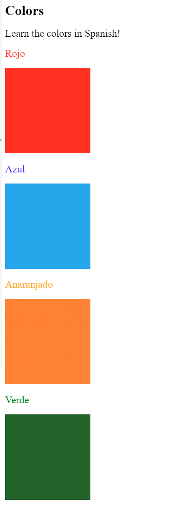

# 100 Days of Code: Day 43 - Introduction to CSS

## Project Overview
**Date:** 8/25/2024

**Goal:**  
Today, I learned the basics of CSS (Cascading Style Sheets), which is a style sheet language used for describing the presentation of a document written in HTML. The focus was on understanding how CSS can be used to add styling to HTML elements without cluttering the HTML file itself.

## Project Details
### 1. Technologies Used
- **Languages:** HTML, CSS
- **Tools:** VS Code

### 2. Key Takeaways

- **Why CSS?**
  - Styling attributes within HTML are deprecated because they add clutter to the HTML file, making it difficult to distinguish content from styling.
  - CSS, introduced in 1996, allows for styling to be attached separately to HTML elements, making the code cleaner and more maintainable.

- **CSS Implementation**:
  - **Inline CSS**: Directly within an HTML element using the `style` attribute. This method is simple but can make the HTML file messy.
  - **Internal CSS**: Placed within the `<style>` tag inside the HTML document’s `<head>` section. This method is useful for single-page applications.
  - **External CSS**: Linked through an external `.css` file using the `<link>` tag. This method is preferred for multi-page websites as it separates content from design, making it easier to manage styles across multiple pages.

- **CSS Selectors**: Various selectors in CSS help apply styles to specific elements:
  - **Element Selector**: Targets all instances of a specific HTML tag (e.g., `h1`).
  - **Class Selector**: Denoted by a dot (`.`), it allows the same style to be applied to multiple elements by assigning them a common class.
  - **ID Selector**: Prefixed with a hash (`#`), it applies styles to a unique element within the HTML document.
  - **Attribute Selector**: Targets elements based on their attributes (e.g., `[draggable]`).
  - **Universal Selector**: Represented by an asterisk (`*`), it applies styles to all elements within the document.

### 3. Final Project - CSS Styling for Spanish Colors Learning Website

### Final Project - CSS Styling for Spanish Colors Learning Website

For the final project, I worked on creating a website designed to help users learn colors in Spanish. The primary focus was on applying CSS to style the website, making it both visually appealing and functional for language learners.

The website included the following elements:

- **Color Names in Spanish**: The core content of the website consisted of a list of colors with their corresponding names in Spanish. Each color name was displayed alongside a colored block to visually represent the color, helping users make a direct connection between the word and the visual color.

- **CSS Styling**: I applied various CSS techniques to enhance the learning experience:
  - **Background Colors**: Each color name was paired with a background color matching the color it represents. This created a clear and intuitive learning interface.

### 4. Screenshots 

### 5. Tomato Count

Day 43 Lessons/Project took: [🍅🍅🍅🍅]